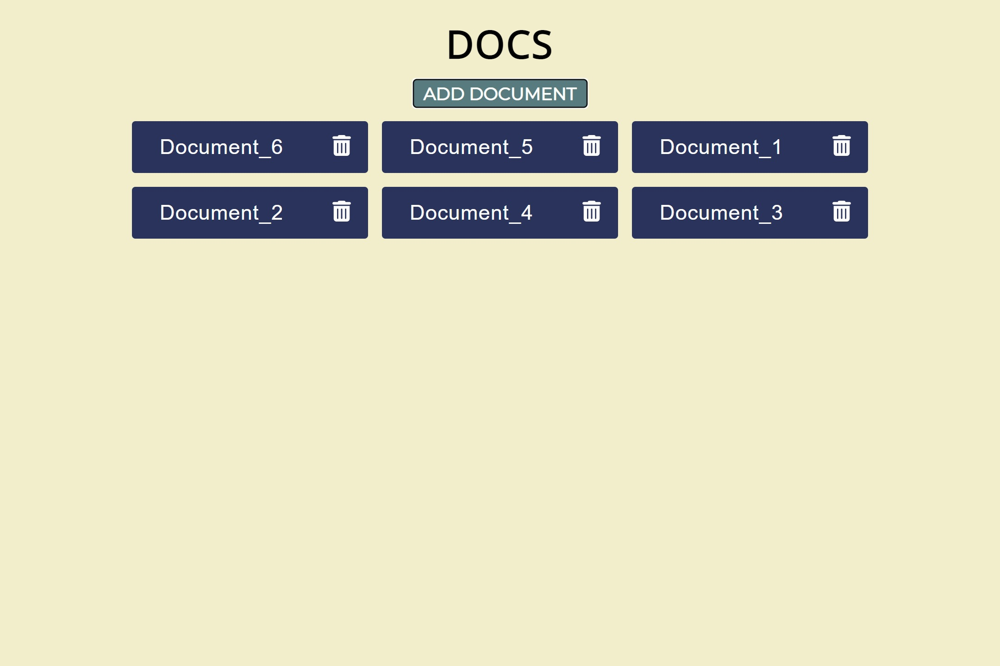
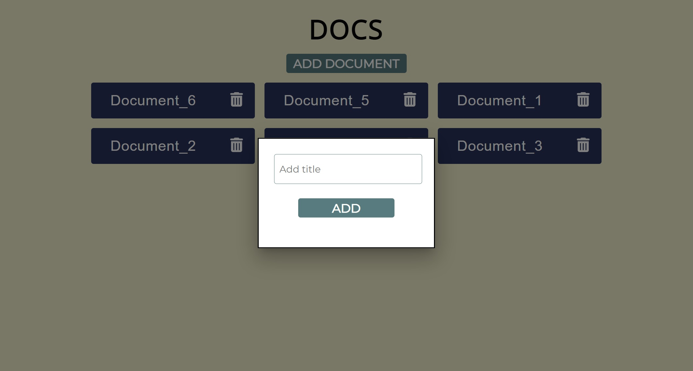
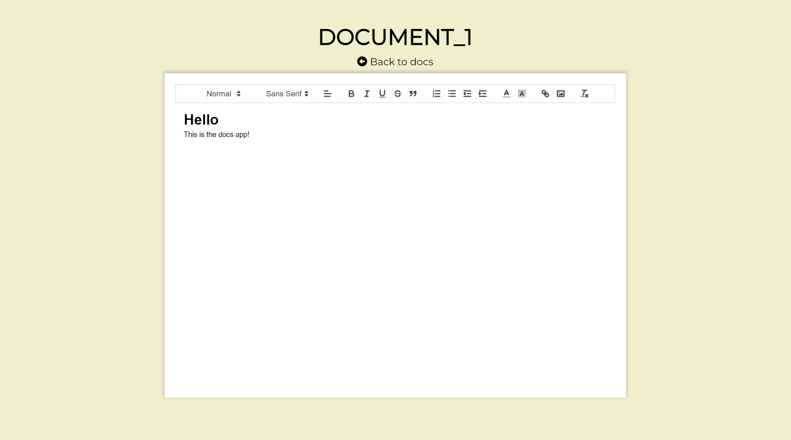

<h1>Docs</h1>

Check it on <a href="https://docs-mad3dqfuo-tamaskovacs0408.vercel.app/" taget="_blank">here</a>

**About**

This React app can create documents what you can edit or delete, they are shared public. The documents can be edited real time and two people can work on the same document. The app using Firebase / Firestore to store the data, React Toastify for the notifications and React Router V6 for the routing.

**Source**

<a href="https://mui.com/">Material UI</a>
<a href="https://firebase.google.com/">Firebase</a>
<a href="https://www.npmjs.com/package/react-quill">React Quill</a>
<a href="https://www.npmjs.com/package/react-toastify">React Toastify</a>
<a href="https://www.npmjs.com/package/@fortawesome/react-fontawesome">Fontawesome Icons</a>

**Screenshots**

